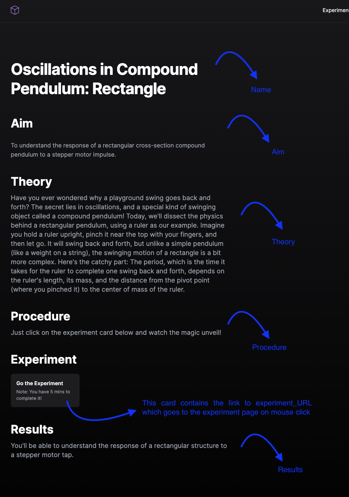

# RT-Labs - Open Source Architecture (NITK)

## 1. How do I set it up on my device?

1. Clone this repository to your system (preferably use GitHub Desktop)
2. Open the repository on your preferred code editor (I'll choose VS Code)
3. Now that we have the files ready we need to make sure we have some basic modules installed

Modules / Dependencies required before we proceed:
> -  NodeJS + npm (https://nodejs.org/en/download)
> We'll download the latest version and we have npm (node package manager included in it)
> - nvm (Node Version Manager) In case you have an existing NodeJS installation we need to be using a Node version of > 18.6.0 so it's advised to have NVM in case you've already tried out Node some time ago.

4. Now that we have NodeJS and npm installed go to the project and open the Terminal (this should be the path if you have used GitHub desktop & have opened as VS Code Terminal)


5. Run the following command to install all the dependencies:
 
   ``` npm install ```
6. Now run the following command to install NextJS globally in your system (remove -g in case you don't want to install it globally):
   
   ``` npm install next -g ```

7. Run the following command to build the NextJS project:
 
   ``` npm run build ```

You should be able to see something like this in your terminal:


8. Now that we have our project built, we can run the following command:

    ``` npm start```

If all happens according to plan, you might be able to see something like this in your terminal:


And when you visit [localhost:3000](http://localhost:3000) you'll be able to see this:


## 2. How do I access the *Experiments* sections?

If you have explored enough you might have noticed that the experiment page doesn't open.

The reason for that is that the experiment page is on:
 ``` <predefined_ip_address>:3000/exps/expt-8/index.html ```

The issue with this is that we are not on that IP address and hence the link is inaccessible.

To rectify this we need to change the "predefined_ip_address" to the IP address of the device hosting the website.

That can be changed by logging into Sanity CMS and if you are a collaborator on this project you will be able to edit the "predefined_ip_address" to your requirements.

## 3. Edit-Add-Remove Experiments

Go to the [Admin Page](http://localhost:3000/admin) of the website. ("localhost:3000/admin" in case the link doesn't work).


Login with your registered credentials as a collaborator.

> Note: In case you aren't a collaborator you'll see something like this. 


If you are a collaborator already you'll see something like this:


Now go to the **Projects** section in the Admin Page & select any experiment.


You'll notice the *experiment_URL* section, replace '10.100.80.193:3000' with '<your_ip_address>:3000'

And that's it, just save your changes, and voila!

RTLabs-Open Source Web Application is now running on your system too!

### Existing Experiments & Parameters

Replace "<your_ip_address>" with the IP address of the device hosting the web application

> Note: If you are hosting the web appliaction, the url to it on the network would be <your_ip_address>:3000, so make sure you know your IP Address

### Experiments Table

> Any new experiment that has been added please do update this table, (it'll make me happier to see the list grow! )

| Experiment No | Title of Experiment | experiment_URL |
| ------------- | -------------       | --------------  | 
| 1             | Forced Vibration of a Cantilever Beam - DC Motor        |<your_ip_address>:3000/exps/expt-1/index.html              |
| 2             | Free Vibration of a Cantilever Beam - Stepper Motor        | <your_ip_address>:3000/exps/expt-2/index.html             |
| 3             | Forced Vibration of a Cantilever Beam - Electromagnetic Shaker        | <your_ip_address>:3000/exps/expt-3/index.html              |
| 4             | Forced Vibration of a Cantilever Beam - Piezostack        | <your_ip_address>:3000/exps/expt-4/index.html              |
| 5             | Free Vibration of a Fixed-Fixed Beam: Stepper Motor        | <your_ip_address>:3000/exps/expt-5/index.html              |
| 6             | Oscillations in Compound Pendulum: Hexagon        | <your_ip_address>:3000/exps/expt-6/index.html              |
| 7             | Oscillations in a Compound Pendulum: Square        | <your_ip_address>:3000/exps/expt-7/index.html              |
| 8             | Oscillations in Compound Pendulum: Rectangle        | <your_ip_address>:3000/exps/expt-8/index.html              |
| 9             | Oscillations in Compound Pendulum: Circle        | <your_ip_address>:3000/exps/expt-9/index.html              |
| 10             | Oscillations in Compound Pendulum: Triangle        | <your_ip_address>:3000/exps/expt-10/index.html              |

### Add New Experiment


Click on the + icon as in the image and you'll have the option to add a new experiment.

### Parameters for Each Experiment

```python
1. Name 
2. Tagline
3. Project Logo (Optional)
4. Cover Image (Optional)
5. Aim
6. Slug (Just click on generate)
7. Theory
8. Procedure
9. Results
10. Assignments (Optional)
11. experiment_URL
```




> Note: Slug is used by NextJS to route the experiment card to the right experiment, so hence it is not a part of the experiment content, so nothing to worry if you're just here to add an experiment, because NextJS will automatically route the newly generated card to the experiment details you have entered.

## 4. What to do to create an experiment on the targeted "experiment_URL"?

To make an experiment page we must first understand the **pages/api** & **public** folder of this repository.

### ```pages/api```

1. Create a new JavaScript File named expt-*<expt_no.>*.js
   
   Example: If you are creating the 11th experiment name it as *"expt_11.js"*

2. Copy-paste the code from any of the existing API files  (for example let us copy from the *"expt_9.js"* file)

    > For more detailed explanation of the code go here.

3. Make the following changes:

   ```javascript
   const csvContent = ['accel_x, accel_y, accel_z']; // Array to store CSV data
    const fs = require('fs'); // For temporary file creation (optional)
    const { saveAs } = require('file-saver'); // File saver library
    const path = require('path');

    export default async function handler(req, res) {
    const API_URL = REPLACE_WITH_YOUR_EXPERIMENT_IP_ADDRESS; // Replace with the actual API URL
    const csvContent = ['accel_x, accel_y, accel_z']; // Array to store CSV data
    
    function fetchData() {
        fetch(API_URL)
        .then(response => response.text())
        .then(data => {
            csvContent.push(data);
            console.log(data); // Add fetched data to CSV content array
        })
        .catch(error => console.error('Error fetching data:', error));
    }
    var i=0;
    function downloadCSV() {
        const csvString = csvContent.join('\n'); // Generate CSV string
        const filePath = PATH_TO_REPO+'/my-portfolio/public/'+FOLDER_TO_STORE_DATA_IN_PUBLIC_FOLDER+'/data.txt'; // Replace with your desired file path
        i+=1
        fs.writeFile(filePath, csvString, (err) => {
        if (err) {
            console.error('Error saving CSV file:', err);
            res.status(500).json({ error: 'Error saving CSV file' });
        } else {
            console.log('CSV file saved successfully!');
            res.status(200).json({ message: 'CSV file saved successfully' });
        }
        });
    }
    
    function startFetching() {
        fetch(API_URL+'/run')
        .then(() => {
            setTimeout(() => {
            const intervalId = setInterval(fetchData, 250); // Fetch data every 0.25 seconds
            setTimeout(() => {
                clearInterval(intervalId);
                downloadCSV(); // Download CSV after 10 seconds
            }, 5000);
            }, 10);
        })
        .catch(error => {
            console.error('Error starting data fetching:', error);
            res.status(500).json({ error: 'Error starting data fetching' });
        });
    }
    
    // Start fetching data when this API endpoint is called
    startFetching();
    }
   ```
Variables to be replaced:

| Variable Name | Meaning/Significance | 
| ------------- | -------------       | 
| API_URL            | The URL to the web-server running on your microcontroller         |
| PATH_TO_REPO             | The path to this repository on the device hosting the web application        |         
| FOLDER_TO_STORE_DATA_IN_PUBLIC_FOLDER             | The folder in which our data.txt (Acceleration data) has to be stored        | 


To keep this discussion simple, this code interacts with your experiment hardware (i.e. the web server running on your microcontroller)

It's functions are to:
- Trigger the experiment by running the actuator (be it a motor or a shaker)
- Fetch the data from the web server (the web server sends the accelerometer data as a text response)
- Complie the data and make it a CSV file
- Storing it in filePath mentioned above that is ```PATH_TO_REPO+'/my-portfolio/public/'+FOLDER_TO_STORE_DATA_IN_PUBLIC_FOLDER```
as a file named as ```data.txt```


### ```public```

1. Create a new Folder named data-*<expt_no.>*
   
   Example: If you are creating the 11th experiment name the folder as *"data-11"*

2. Now assign the variable ```FOLDER_TO_STORE_DATA_IN_PUBLIC_FOLDER``` to the folder just created.
3. Our data now has a path to be stored in!

### ```public/exps```

1. Create a new Folder named expt-*<expt_no.>*
   
   Example: If you are creating the 11th experiment name the folder as *"expt-11"*

2. Copy-paste the code from any of the existing folders  (for example let us copy from the *"expt-9"* folder)

    > For more detailed explanation of the code go here.

3. You'll have 3 folders & 1 HTML file to deal with:
   ```python
    - css
    - images
    - js
    - index.html
   ```

4. We only need to edit the ```index.html``` file

5. Make the following changes:
   
  ```html
   <!DOCTYPE html>
<html lang="en">
  <head>
    <meta charset="UTF-8" />
    <meta http-equiv="X-UA-Compatible" content="IE=edge" />
    <meta name="viewport" content="width=device-width, initial-scale=1.0" />
    <title>SOLVE</title>
    <!-- <link rel="preconnect" href="https://fonts.googleapis.com">
<link rel="preconnect" href="https://fonts.gstatic.com" crossorigin>
<link href="https://fonts.googleapis.com/css2?family=DM+Sans:wght@400;500;700&display=swap" rel="stylesheet"> -->
<link rel="preconnect" href="https://fonts.googleapis.com">
<link rel="preconnect" href="https://fonts.gstatic.com" crossorigin>
<link href="https://fonts.googleapis.com/css2?family=Nunito:wght@400;500;600;700&display=swap" rel="stylesheet">
<script src="https://cdn.zingchart.com/zingchart.min.js"></script>
<script type="text/javascript" src="https://canvasjs.com/assets/script/jquery-1.11.1.min.js"></script>
<script type="text/javascript" src="https://cdn.canvasjs.com/canvasjs.min.js"></script>
<script src="https://cdn.canvasjs.com/canvasjs.min.js"></script>

    <link
      rel="stylesheet"
      href="https://code.jquery.com/ui/1.13.2/themes/base/jquery-ui.css"
    />
    <link rel="stylesheet" href="css/general.css" />
    <link rel="stylesheet" href="css/style.css" />
    <link rel="stylesheet" href="css/query.css" />
    <!-- <script defer src="https://code.jquery.com/jquery.min.js"></script>
    <script
      defer
      src="https://code.jquery.com/jquery-3.7.0.min.js"
      integrity="sha256-2Pmvv0kuTBOenSvLm6bvfBSSHrUJ+3A7x6P5Ebd07/g="
      crossorigin="anonymous"
    ></script>
    <script
      defer
      src="https://code.jquery.com/ui/1.8.17/jquery-ui.min.js"
    ></script>
    <script defer src="https://code.jquery.com/jquery-3.6.0.js"></script>
    <script defer src="https://code.jquery.com/ui/1.13.2/jquery-ui.js"></script>
    <script
      defer
      type="text/javascript"
      src="//cdnjs.cloudflare.com/ajax/libs/jqueryui-touch-punch/0.2.3/jquery.ui.touch-punch.min.js"
    ></script>

    <script defer src="js/script.js"></script> -->
  </head>
  <body onload="startsim();varinit();
">
    <!-- Logo -->
    <!-- Experiment Title -->
    <!-- Tools Sections -->
    <!-- Tools Container -->
    <!-- Simulation Container -->
    <div class="title-div">
      <!-- <span class="round left-top"></span>
      <span class="round left-bottom"></span>
      <span class="round right-top"></span>
      <span class="round right-bottom"></span> -->
      <div class="logo-div">
        <a href="#"></a>
      </div>
      <h1>YOUR_EXPERIMENT_TITLE</h1>
    </div>
    <div class="container">
     

      <div class="main">
        
        <div class="main-section">
          
          <div id="simulation" class="main__task-div">
            <div id="controls" class="div__control">
              <!--  -->
              
            </div>
            <h3 class="task-title">Actuation Modes</h3>
            <div class="canvas__div">
              <div id="chartContainer" style="width:100%; height:300px; opacity: 0%;"></div>
              
              <div class = "button-container">
                <!-- <button id="generatePlot" onclick="runMotor()">Load</button>
                <button id="generatePlot" onclick="runStepperMotor()">Load Stepper</button> -->
                <button id="loadButton" onclick="runExpt()">Start Experiment!</button>
        
                </div>
              <div class="img-div">
                <div class="circuit-dia">
                  <!--  -->
                  <!--Put our buttons-->
                  

                  <span class="tooltip cir-tooltip"></span>
                </div>
                <!-- <div class="cross-img">
                  
                </div> -->
                <!-- <div class="other-sec display-hide">
                  <div>
                    <label for="CsArea">C/s Area(m^2)</label>
                    <input class="var-spinner" id="CsArea" name="value" />
                  </div>
                  <div>
                    <label for="Ivalue">Ixx(m^4) </label>
                    <input class="var-spinner" id="Ivalue" name="value" />
                  </div>
                </div> -->
                <div>
                  
                </div>
               
              </div>
              <div id="canvas-container">
               
                <!-- <iframe class = "img" src = "http://localhost:8080/live_stream_1/"> -->
                <!-- <iframe src="http://localhost:8080/live_stream_1" type="video/mp4"  style="position: inherit;width: 100%;height: 100%;"></iframe>  -->
                <!-- <canvas id="canvas" class="canvas">
                 
                </canvas>
               
              </div>
              <div class="graph-div display-hide" id="generatePlot"></div>
              <!-- <div class="graph-div display-hide" id="zingchart-graphscreen2"></div> -->
              <!-- <div class="graph-div display-hide">
                <canvas id="graphscreen1" class="canvas">
                

                </canvas>
              </div>
              <div class="graph-div display-hide">
                <canvas id="graphscreen2" class="canvas"></canvas>
              </div> -->
            </div>
          </div>
          </div>
          <div class="main__task-div footer">
            <p>Copyright © SOLVE The Virtual Lab @ NITK Surathkal</p>
          </div>
        </div>
      </div>
    </div>
    <script>
      // Function to show or hide buttons based on the selected option
      //Load and Load stepper button fuction
      var i=-1
      function runExpt() {
      // Make a fetch request to the Express server to run the motor.
      fetch('http://<your_ip_address>:3000/api/expt-9')
        .then(response => response.text())
        .then(text => {
          // The motor is running!
          i+=1;
          console.log(i)
        });
    }
    function plotgraph()
    {
      document.getElementById('chartContainer').style.opacity = 100;
    }

    window.onload = function() {
        var dataPoints = [];
        function getDataPointsFromCSV(csv) {
            var dataPoints = csvLines = points = [];
            console.log("H-2")
            csvLines = csv.split(/[\r?\n|\r|\n]+/);         
		        var sum = parseFloat(0);
            for(var i=0;i<csvLines.length;i++)
            {
              if(csvLines[i].length>0)
              {
                points = csvLines[i].split(",");
              }
            }
            for (var i = 0; i < csvLines.length; i++)
                if (csvLines[i].length > 0) {
                    points = csvLines[i].split(",");
                    dataPoints.push({ 
                        x: parseFloat(i+1), 
                        y: parseFloat(points[0]) 		
                    });
                    console.log("H-3")
                }
            return dataPoints;
        }
	
	$.get("http://<your_ip_address>:3000/FOLDER_TO_STORE_DATA_IN_PUBLIC_FOLDER/data.txt", function(data) {
	    var chart = new CanvasJS.Chart("chartContainer", {
		    title: {
		         text: "Acceleration vs Time",
		    },
		    data: [{
		         type: "spline",
		         dataPoints: getDataPointsFromCSV(data)
          //   dataPoints: [
          //     {x: new Date(2002, 0), y: 2506000},
          //     {x: new Date(2003, 0), y: 2798000},
          //     {x: new Date(2004, 0), y: 3386000},
          //     {x: new Date(2005, 0), y: 6944000},
          //     {x: new Date(2006, 0), y: 6026000},
          //     {x: new Date(2007, 0), y: 2394000},
          //     {x: new Date(2008, 0), y: 1872000},
          //     {x: new Date(2009, 0), y: 2140000},
          //     {x: new Date(2010, 0), y: 7289000},
          //     {x: new Date(2011, 0), y: 4830000},
          //     {x: new Date(2012, 0), y: 2009000},
          //     {x: new Date(2013, 0), y: 2840000},
          //     {x: new Date(2014, 0), y: 2396000},
          //     {x: new Date(2015, 0), y: 1613000},
          //     {x: new Date(2016, 0), y: 2821000},
          //     {x: new Date(2017, 0), y: 2000000}
          //   ]
		      }]
	     });
		
	      chart.render();

	});
  }

    //   const generatePlotButton = document.getElementById("generatePlot");
    // generatePlotButton.addEventListener("click", () => {
    //   // Open the plot page in a new window/tab
    //   window.open("/plotPage.html", "_blank");
    // });
    

    // Example ZingChart configurations for graphs
  //   const chartConfig1 = {
  //     type: 'line',
  //     series: [{ values: [5, 10, 15, 20, 25] }],
  //   };

  //   const chartConfig2 = {
  //     type: 'bar',
  //     series: [{ values: [30, 20, 10, 15, 5] }],
  //   };

  //   // Render ZingChart graphs in the specified containers
  //   renderZingChartGraph('zingchart-graphscreen1', chartConfig1);
  //   renderZingChartGraph('zingchart-graphscreen2', chartConfig2);

  //   // Show the graph containers after rendering the graphs
  //   document.getElementById('zingchart-graphscreen1').style.display = 'block';
  //   document.getElementById('zingchart-graphscreen2').style.display = 'block';
  // }

  // // Function to render ZingChart graphs
  // function renderZingChartGraph(containerId, chartConfig) {
  //   zingchart.render({
  //     id: containerId,
  //     data: chartConfig,
  //     height: '300px',
  //     width: '100%'
  //   });
  // }
  
   </script>

   
    
    
  </body>
</html>
  ```

Variables to be replaced:

| Variable Name | Meaning/Significance | 
| ------------- | -------------       | 
| YOUR_EXPERIMENT_TITLE           | Name of the Experiment         |
| LIVE_STREAM_LINK          | Link to the live stream of this experiment         |
| <your_ip_address>            | The IP address of the device hosting the web application        |         
| FOLDER_TO_STORE_DATA_IN_PUBLIC_FOLDER             | The folder in which our data.txt (Acceleration data) has to be stored (if it's the 11th expt then it is *expt-11*)        | 

With this we have successfully crearted the HTML Page that:
 - Contains the Live Stream
 - Contains the Buttons to access the API file that is in ```pages/api```
 - Plot the graph of the data we have stored in the CSV file.

And voila we are done with adding an experiment!

## 5. Bonus Topic: ```pages/api``` & ```public/exps/expt-$[1-10]/index.html``` explained

### ```pages/api```

There are 3 utility functions used in every ```NodeJS``` file in ```pages/api```.
   #### 1. Fetching Data: ```fetchData()```
   ```javascript
    const API_URL = REPLACE_WITH_YOUR_EXPERIMENT_IP_ADDRESS; // Replace with the actual API URL
    const csvContent = ['accel_x, accel_y, accel_z']; // Array to store CSV data
    
    function fetchData() {
        fetch(API_URL)
        .then(response => response.text())
        .then(data => {
            csvContent.push(data);
            console.log(data); // Add fetched data to CSV content array
        })
        .catch(error => console.error('Error fetching data:', error));
    }
```
 - Names the column headers as ['accel_x, accel_y, accel_z']
 - Response from the API is pushed into the csvContent list
 - fetch-catch used to detect any error while data being taken from the API

   #### 2. Saving the fetched data as a CSV: ```startFetching()```
   ```javascript
   function startFetching() {
        fetch(API_URL+'/run')
        .then(() => {
            setTimeout(() => {
            const intervalId = setInterval(fetchData, 250); // Fetch data every 0.25 seconds
            setTimeout(() => {
                clearInterval(intervalId);
                downloadCSV(); // Download CSV after 10 seconds
            }, 5000);
            }, 10);
        })
        .catch(error => {
            console.error('Error starting data fetching:', error);
            res.status(500).json({ error: 'Error starting data fetching' });
        });
    }
    
    // Start fetching data when this API endpoint is called
    startFetching();
    ```
 - Triggering the actuator first (API_URL+/run)
 - Using setInterval & setTimeout to call ```fetchData()``` for every 0.25 seconds for 5 seconds in total
 - Uses ```downloadCSV()``` to save the file after 5 seconds
 - fetch-catch used to detect any error while data being taken from the API

#### 3. Saving the file as a CSV: ```downloadCSV()```
   ```javascript
    var i=0;
    function downloadCSV() {
        const csvString = csvContent.join('\n'); // Generate CSV string
        const filePath = PATH_TO_REPO+'/my-portfolio/public/'+FOLDER_TO_STORE_DATA_IN_PUBLIC_FOLDER+'/data.txt'; // Replace with your desired file path
        i+=1
        fs.writeFile(filePath, csvString, (err) => {
        if (err) {
            console.error('Error saving CSV file:', err);
            res.status(500).json({ error: 'Error saving CSV file' });
        } else {
            console.log('CSV file saved successfully!');
            res.status(200).json({ message: 'CSV file saved successfully' });
        }
        });
    }
```
 - The file is saved as a CSV in the filePath mentioned in the ```filePath``` variable.

### ```public/exps/expt-$[1-10]/index.html```

#### HTML code with all the necessary components:
  1. Live Stream
  2. Start Experiment Button
  3. Plot Graph Button

```html
      
      <div class="main-section">
        
        <div id="simulation" class="main__task-div">
          <div id="controls" class="div__control">
            
          </div>
          <h3 class="task-title">Actuation Modes</h3>
          <div class="canvas__div">
            <div id="chartContainer" style="width:100%; height:300px; opacity: 0%;"></div>
            
            <div class = "button-container">
              <button id="loadButton" onclick="runExpt()">Start Experiment!</button>
      
              </div>
            <div class="img-div">
              <div class="circuit-dia">
                <!--  -->
                <!--Put our buttons-->
                

                <span class="tooltip cir-tooltip"></span>
              </div>
             
            </div>
```

#### 1. Run Experiment: ```runExpt()```

 ```javascript
      function runExpt() {
      // Make a fetch request to the NextJS route to run the pages/api utility code.
      fetch('http://<your_ip_address>:3000/api/expt-9')
        .then(response => response.text())
        .then(text => {
          // The motor is running!
          i+=1;
          console.log(i)
        });
    }
```
#### 2. Plot the graph: ```plotgraph()```
```javascript
    function plotgraph()
    {
      document.getElementById('chartContainer').style.opacity = 100;
    }
```
#### 3. Convert CSV to JSON Array for ChartJS : ```getDataPointsFromCSV(csv)```
```javascript
    window.onload = function() {
        var dataPoints = [];
        function getDataPointsFromCSV(csv) {
            var dataPoints = csvLines = points = [];
            console.log("H-2")
            csvLines = csv.split(/[\r?\n|\r|\n]+/);         
		        var sum = parseFloat(0);
            for(var i=0;i<csvLines.length;i++)
            {
              if(csvLines[i].length>0)
              {
                points = csvLines[i].split(",");
              }
            }
            for (var i = 0; i < csvLines.length; i++)
                if (csvLines[i].length > 0) {
                    points = csvLines[i].split(",");
                    dataPoints.push({ 
                        x: parseFloat(i+1), 
                        y: parseFloat(points[0]) 		
                    });
                    console.log("H-3")
                }
            return dataPoints;
        }
```

#### 4. Plot the graph using ChartJS :

```javascript
	$.get("http://<your_ip_address>:3000/FOLDER_TO_STORE_DATA_IN_PUBLIC_FOLDER/data.txt", function(data) {
	    var chart = new CanvasJS.Chart("chartContainer", {
		    title: {
		         text: "Acceleration vs Time",
		    },
		    data: [{
		         type: "spline",
		         dataPoints: getDataPointsFromCSV(data)
          
		      }]
	     });
		
	      chart.render();

	});
  }
```
