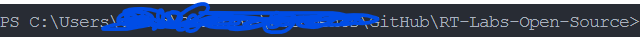
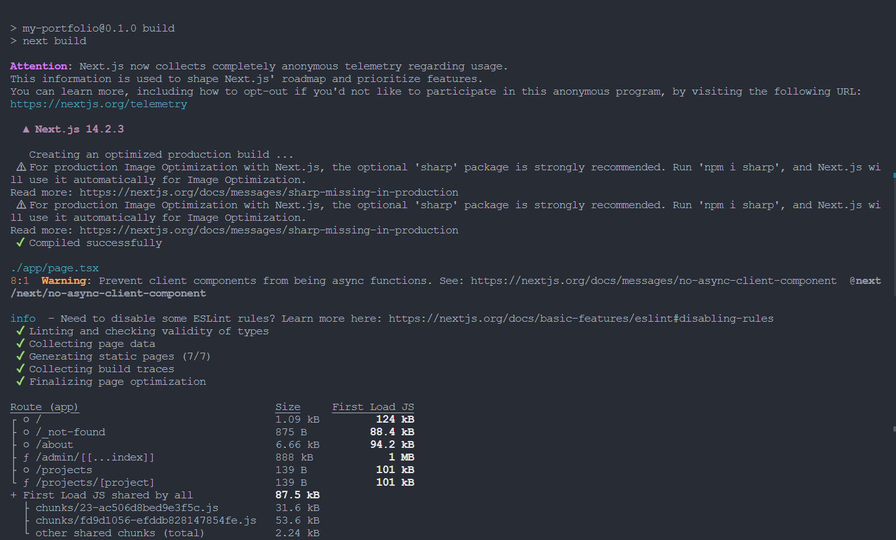
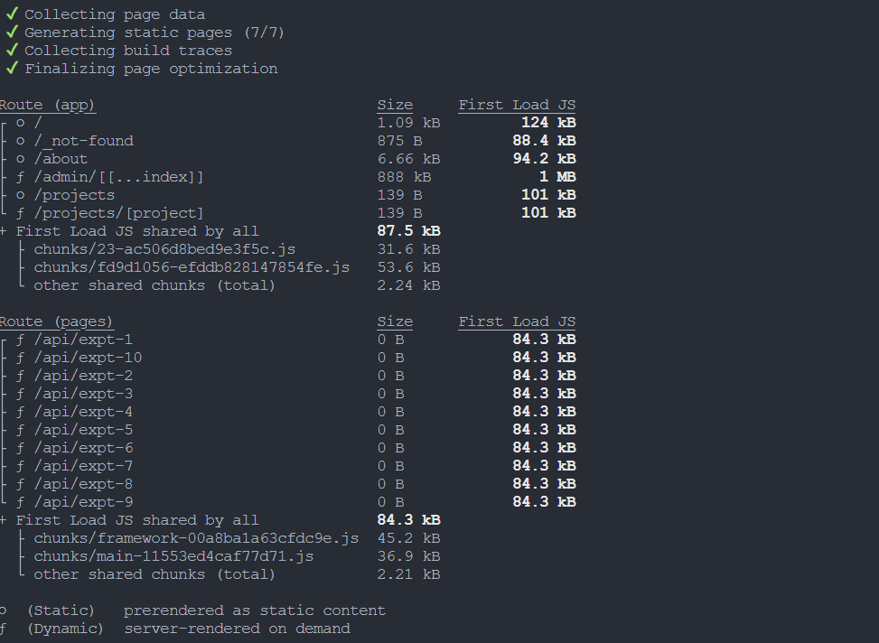
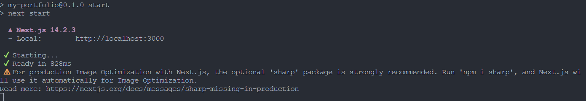
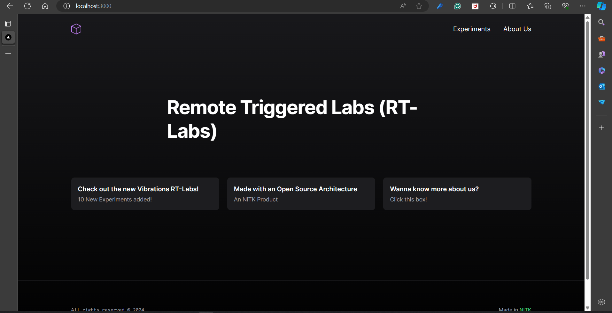
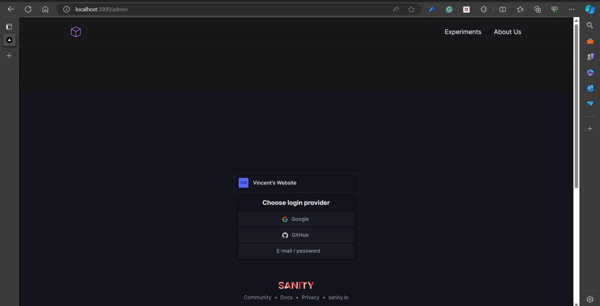
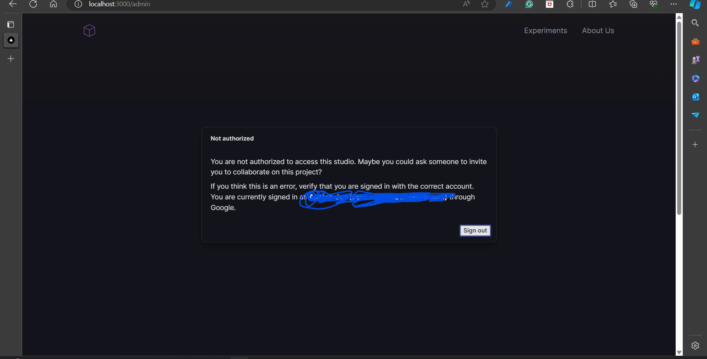
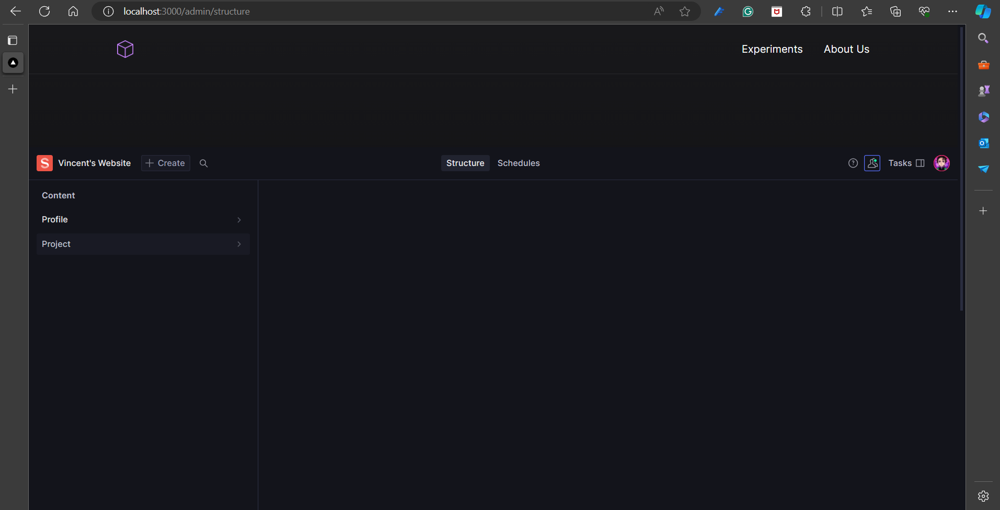
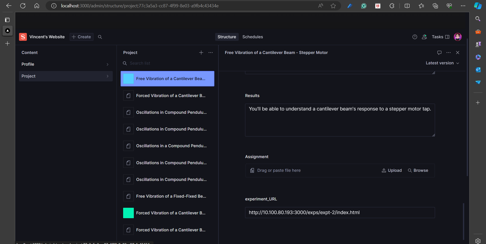

This is a [Next.js](https://nextjs.org/) project bootstrapped with [`create-next-app`](https://github.com/vercel/next.js/tree/canary/packages/create-next-app).

## Getting Started

First, run the development server:

```bash
npm run dev
# or
yarn dev
# or
pnpm dev
# or
bun dev
```

Open [http://localhost:3000](http://localhost:3000) with your browser to see the result.

You can start editing the page by modifying `app/page.tsx`. The page auto-updates as you edit the file.

This project uses [`next/font`](https://nextjs.org/docs/basic-features/font-optimization) to automatically optimize and load Inter, a custom Google Font.

## Learn More

To learn more about Next.js, take a look at the following resources:

- [Next.js Documentation](https://nextjs.org/docs) - learn about Next.js features and API.
- [Learn Next.js](https://nextjs.org/learn) - an interactive Next.js tutorial.

You can check out [the Next.js GitHub repository](https://github.com/vercel/next.js/) - your feedback and contributions are welcome!

## Deploy on Vercel

The easiest way to deploy your Next.js app is to use the [Vercel Platform](https://vercel.com/new?utm_medium=default-template&filter=next.js&utm_source=create-next-app&utm_campaign=create-next-app-readme) from the creators of Next.js.

Check out our [Next.js deployment documentation](https://nextjs.org/docs/deployment) for more details.

---

# RT-Labs - Open Source Architecture made by NITK

## 1. How do I set it up?

1. Clone this repository to your system (preferably use GitHub Desktop)
2. Open the repository on your preferred code editor (I'll choose VS Code)
3. Now that we have the files ready we need to make sure we have some basic modules installed

Modules / Dependencies required before we proceed:
> -  NodeJS + npm (https://nodejs.org/en/download)
> We'll download the latest version and we have npm (node package manager included in it)
> - nvm (Node Version Manager) In case you have an existing NodeJS installation we need to be using a Node version of > 18.6.0 so it's advised to have NVM in case you've already tried out Node some time ago.

4. Now that we have NodeJS and npm installed go to the project and open the Terminal (this should be the path if you have used GitHub desktop & have opened as VS Code Terminal)



5. Run the following command to install all the dependencies:
 
   ``` npm install ```
6. Now run the following command to install NextJS globally in your system (remove -g in case you don't want to install it globally):
   
   ``` npm install next -g ```

7. Run the following command to build the NextJS project:
 
   ``` npm run build ```

You should be able to see something like this in your terminal:





8. Now that we have our project built, we can run the following command:

    ``` npm start```

If all happens according to plan, you might be able to see something like this in your terminal:



And when you visit [localhost:3000](http://localhost:3000) you'll be able to see this:



## 2. How do I start editing it and access the experiments sections?

If you have explored enough you might have noticed that the experiment page doesn't open.

The reason for that is that the experiment page is on:
 ``` <predefined_ip_address>:3000/exps/expt-8/index.html ```

The issue with this is that we are not on that IP address and hence the link is inaccessible.

To rectify this we need to change the "predefined_ip_address" to the IP address of the device hosting the website.

That can be changed by logging into Sanity CMS and if you are a collaborator on this project you will be able to edit the "predefined_ip_address" to your requirements.

## 3. Sanity CMS

Go to the [Admin Page](http://localhost:3000/admin) of the website. ("localhost:3000/admin" in case the link doesn't work).



Login with your registered credentials as a collaborator.

> Note: In case you aren't a collaborator you'll see something like this. 



If you are a collaborator already you'll see something like this:



Now go to the **Projects** section in the Admin Page & select any experiment.



You'll notice the *experiment_URL* section, replace '10.100.80.193:3000' with '<your_ip_address>:3000'

And that's it, just save your changes, and voila!

RTLabs-Open Source Web Application is now running on your system too!
